# Laporan Resmi Praktikum Komunikasi Data dan Jaringan Komputer

# Jarkom K22

## Member

| No  | Nama                   | NRP        |
| --- | ---------------------- | ---------- |
| 1   | Kanafira Vanesha Putri | 5027241010 |
| 2   | Reza Aziz Simatupang   | 5027241051 |

## Reporting

### Soal 1

#### Penjelasan

1. Membuat topologi jaringan
   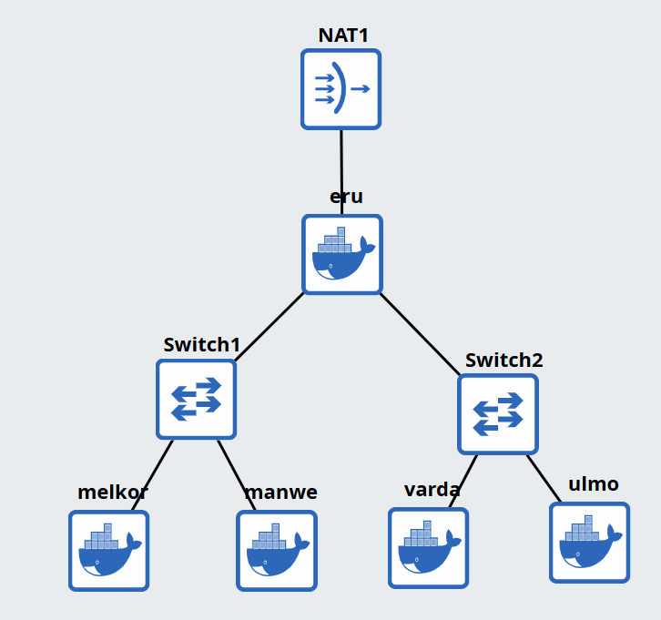 
2. Menyambungkan node eru ke koneksi internet
   * Node eru/router disambungkan ke NAT
3. Menghubungkan antar node client
   * Node client disambungkan kepada masing" gateway
4. Menyambungkan client ainur ke koneksi internet
   * Melakukan configurasi pada masing" node client/router, sesuai nomer 5
5. Menginput script ke /root/.bashrc.
* Pada node eru
<pre>
   apt update && apt install iptables -y
   #!/bin/bash
   echo "=== Configuring ERU (Router) ==="
   iptables -t nat -A POSTROUTING -o eth0 -j MASQUERADE -s 192.222.0.0/16
   echo 1 > /proc/sys/net/ipv4/ip_forward
   echo "Router configured!"
</pre>

  * Pada node client
<pre>
   #!/bin/bash
   echo "=== Configuring Client: $(hostname) ==="
   echo nameserver 192.168.122.1 > /etc/resolv.conf
   echo "Client $(hostname) configured!"
</pre>
6.  Execute file traffic.sh dan packet sniffing di wireshark
   * Download, unzip file, dan execute
     <pre>
        apt update && apt install unzip
        wget --no-check-certificate "https://docs.google.com/uc?export=download&id=1bE3kF1Nclw0VyKq4bL2VtOOt53IC7lG5" -O traffic.zip && unzip traffic.zip
        ./traffic.sh
     </pre>
     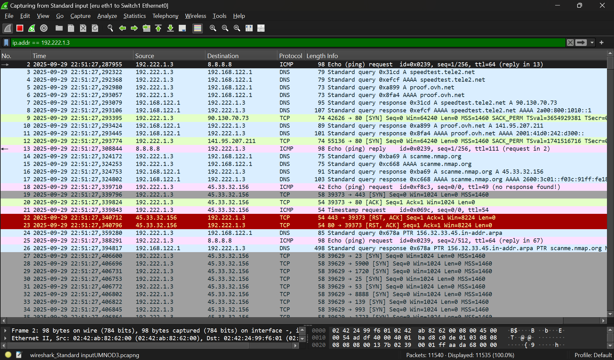
7. Membuat dan konfigurasi FTP server pada node eru, dan buat 2 user baru.
   * install ftp server services
   <pre>
   apt update
   apt install vsftpd
   </pre>

   * buat user dgn hak akses berbeda
   <pre>
   useradd -m -s /bin/bash ainur
   echo "ainur:password123" | chpasswd
   useradd -m -s /bin/bash melkor
   echo "melkor:password456" | chpasswd
   mkdir -p /shared
   chmod 755 /shared
   </pre>

   * edit config ftp
   <pre>
   cp /etc/vsftpd.conf /etc/vsftpd.conf.backup
   sudo tee /etc/vsftpd.conf > /dev/null << EOF
   listen=YES
   anonymous_enable=NO
   local_enable=YES
   write_enable=YES
   local_umask=022
   dirmessage_enable=YES
   use_localtime=YES
   xferlog_enable=YES
   connect_from_port_20=YES
   chroot_local_user=YES
   local_root=/
   allow_writeable_chroot=YES
   secure_chroot_dir=/var/run/vsftpd/empty
   pam_service_name=vsftpd
   pasv_enable=YES
   pasv_min_port=21100
   pasv_max_port=21110
   userlist_enable=YES
   userlist_file=/etc/vsftpd.userlist
   userlist_deny=NO
   EOF
    </pre>        
    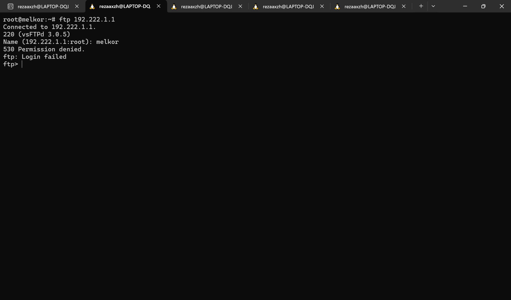                                 
    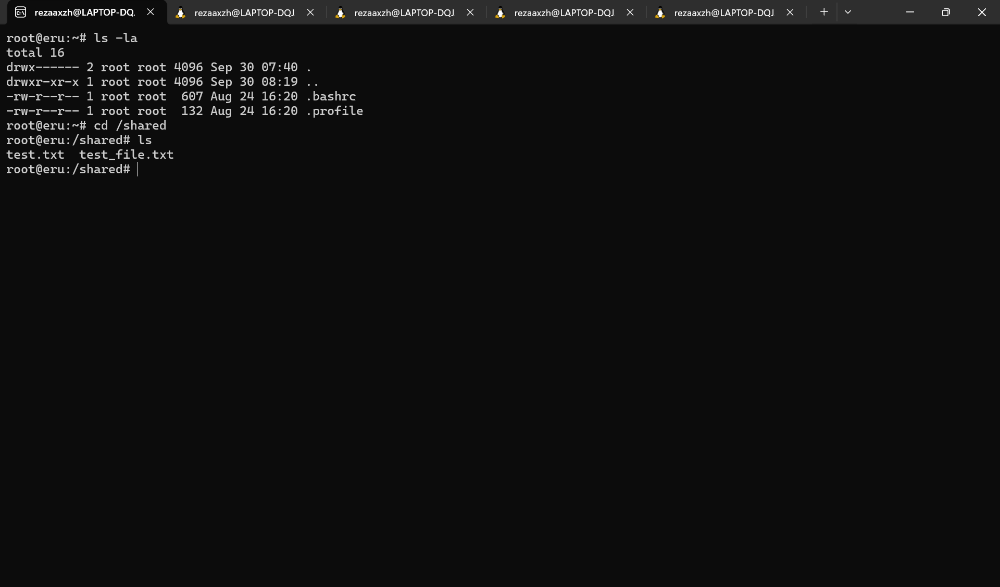                                 
    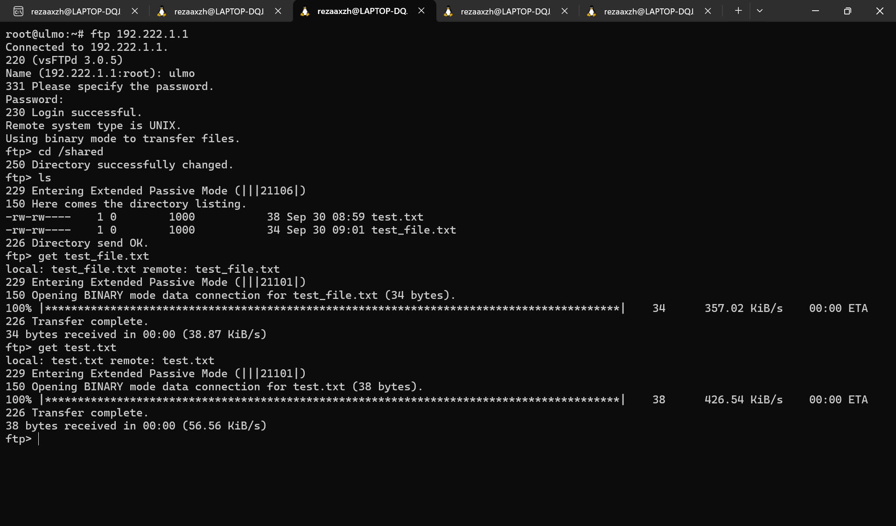                                 

8. Melakukan koneksi dari node ulmo ke FTP Server eru
   * download file diluar ftp dan unzip
     <pre>
        wget --no-check-certificate "https://docs.google.com/uc?export=download&id=11ra_yTV_adsPIXeIPMSt0vrxCBZu0r33" -O cuaca.zip && unzip cuaca.zip
     </pre>

     * config ulang pada /etc/vsftpd.conf
       <pre>
   listen=YES
   anonymous_enable=NO
   local_enable=YES
   write_enable=YES
   local_umask=022
   dirmessage_enable=YES
   use_localtime=YES
   xferlog_enable=YES
   connect_from_port_20=YES
   chroot_local_user=YES
   local_root=/
   allow_writeable_chroot=YES
   secure_chroot_dir=/var/run/vsftpd/empty
   pam_service_name=vsftpd
   pasv_enable=YES
   pasv_min_port=21100
   pasv_max_port=21110
   userlist_enable=YES
   userlist_file=/etc/vsftpd.userlist
   userlist_deny=NO
   </pre>
   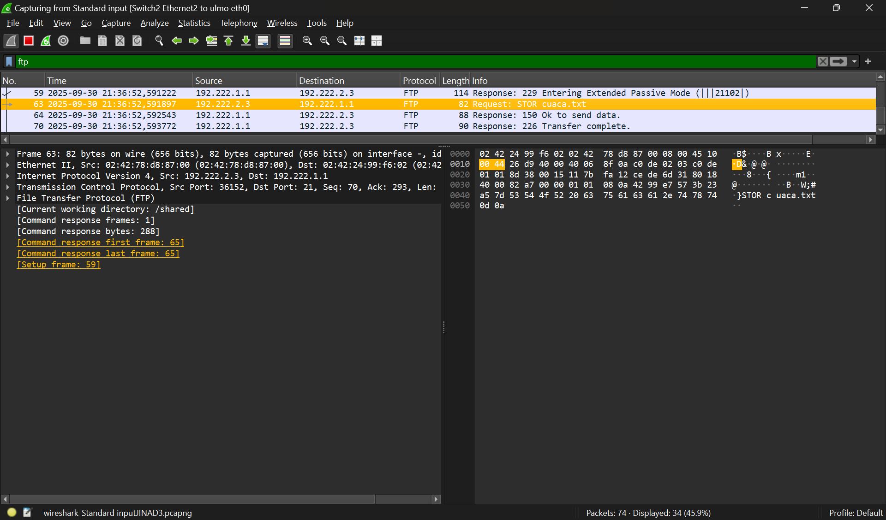  

   * command start server
     <pre>
        service vsftpd restart
     </pre>
   * masuk ke ftp server di node ulmo, lalu cd /shared kirim kan file dari luar fp ke ftp
     <pre>
         put cuaca.txt
     </pre>
       
   
9. Download file dari FTP Server eru ke node manwe. dan rubah hak akses
    * download file di node server/eru di direktorti /shared dan unzip
      <pre>
         wget --no-check-certificate "https://docs.google.com/uc?export=download&id=11ua2KgBu3MnHEIjhBnzqqv2RMEiJsILY" -O kitab_penciptaan.zip
      </pre>
    * dinode manwe login ftp, dan cd ke /shared. lalu get
    <pre>
        get kitab_penciptaan.txt
    </pre>

    * Pada node eru rubah mode ainur agar read only
      <pre>
         chmod 555 /home/ainur
      </pre>

   * Testing
   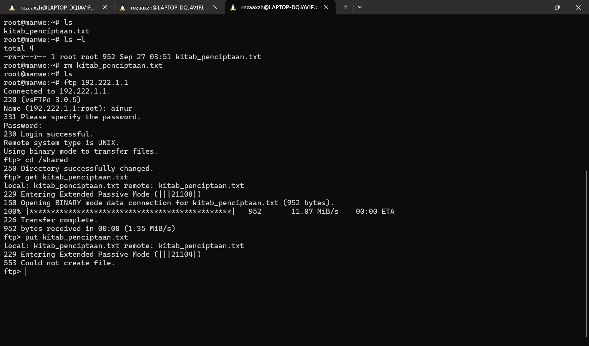 
   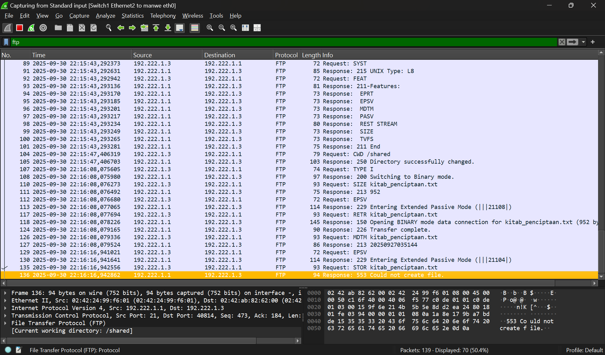 
10. ping ke server eru melalui melkor
    <pre>
       ping 192.222.1.1 -c 100
    </pre>
    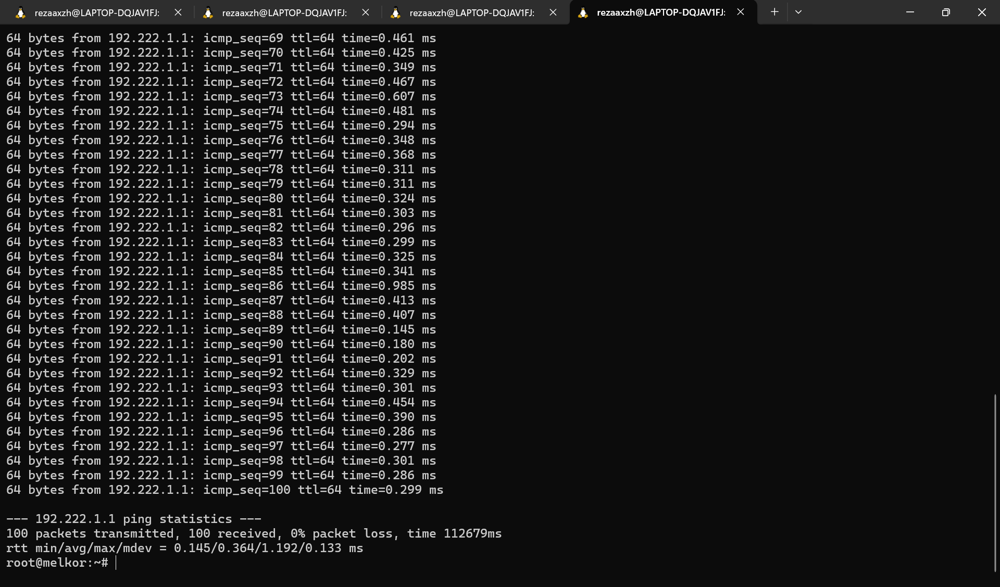 
11. Buat user baru pada node melkor dan masuk dengan telnet melalui node eru
   * Buat user baru
      <pre>
         id eru_test >/dev/null 2>&1 || useradd -m -s /bin/bash eru_test
         passwd eru_test
         id eru_test
      </pre>

   * Update & install telnet service
      <pre>
         apt update
         apt install -y openbsd-inetd telnetd || apt install -y inetutils-inetd inetutils-telnetd || true
      </pre>

   * Restart service inetd
      <pre>
         /etc/init.d/openbsd-inetd restart 2>/dev/null || /etc/init.d/inetutils-inetd restart 2>/dev/null || service xinetd restart 2>/dev/null || true
      </pre>

   * Tambahkan konfigurasi telnet ke inetd.conf
      <pre>
         grep -q '^telnet' /etc/inetd.conf 2>/dev/null || cat >> /etc/inetd.conf <<'EOF'
         telnet  stream  tcp     nowait  root    /usr/sbin/in.telnetd in.telnetd
         EOF
      </pre>

   * Buat symbolic link telnetd → in.telnetd
      <pre>
         ln -s /usr/sbin/telnetd /usr/sbin/in.telnetd
         ls -l /usr/sbin/in.telnetd
      </pre>

   * Restart inetd kembali
      <pre>
         /etc/init.d/openbsd-inetd restart 2>/dev/null || /etc/init.d/inetutils-inetd restart 2>/dev/null || service openbsd-inetd restart 2>/dev/null || true
      </pre>

   * Verifikasi listener port 23
      <pre>
         ss -tulpn | grep :23 || netstat -tulpn | grep :23 || echo "no listener on :23 yet"
      </pre>

   * Lakukan koneksi telnet ke Melkor pada ERU
      <pre>
        telnet 10.94.1.2
      </pre>

   * Login sebagai user
      
12. Port scanning node melkor memalui node eru dengan netcat
   * Install netcat pada eru
      <pre>
        apt update && apt install -y netcat-traditional
      </pre>
   * Scan port 21, 80, 666 pada Melkor
      <pre>
      nc -zv 192.222.1.2 21 80 666
      </pre>
   * buka listener untuk testing pada melkor
      <pre>
      nc -l -p 21 &
      nc -l -p 80 &
      </pre>
   * Install netcat (traditional)
      <pre>
        apt update && apt install -y netcat-traditional
      </pre>
      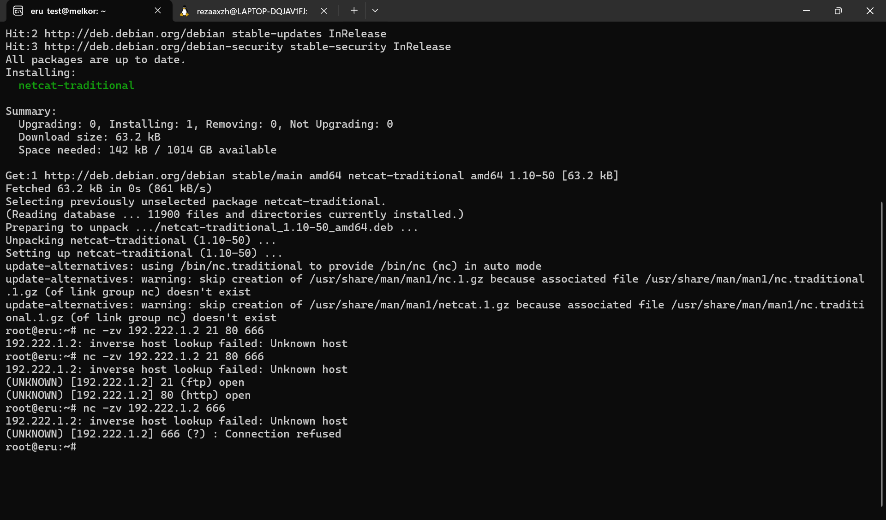 
13. Lakukan koneksi SSH dari node Varda ke Eru
   * Install dan jalankan SSH server di node ERU
      <pre>
        apt update && apt install -y openssh-server
         service ssh start
         service ssh status
      </pre>

   * Buat user baru untuk login
      <pre>
        useradd -m -s /bin/bash varda_user
         echo "varda_user:secretpass456" | chpasswd
      </pre>
   * Install SSH client pada node varda
      <pre>
        apt install -y openssh-client
      </pre>
   * Lakukan login ke ERU
      <pre>
        ssh varda_user@192.222.2.1
      </pre>
      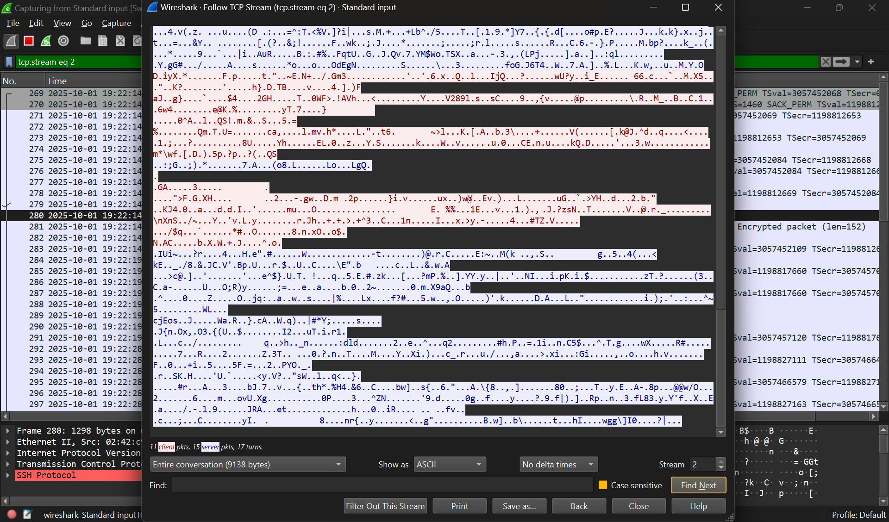 
### Soal 14

Setelah gagal mengakses FTP, Melkor melancarkan serangan brute force terhadap  Manwe. Analisis file capture yang disediakan dan identifikasi upaya brute force Melkor. 

nc 10.15.43.32 3401

#### Penjelasan

Pertama kita melakukan download file lalu mengextract file dan memasukkan file pcap kedalam wireshark.

A) Pockets didapatkan dari ujung bawah dari wiresharknya

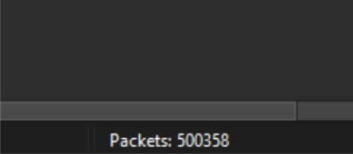


B) User yang berhasil login didapatkan dari tcp.ack

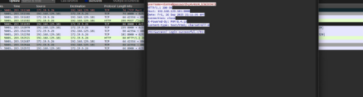


C) Credential ditemukan pada stream 

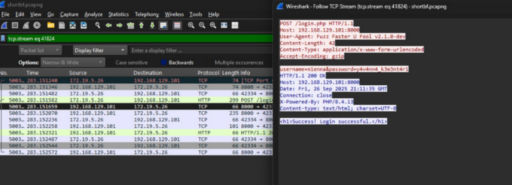


D) Tools yang digunakan juga terdapat pada file yang sama

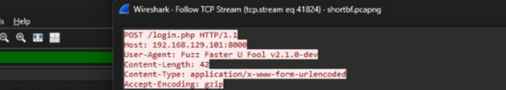


Final Result

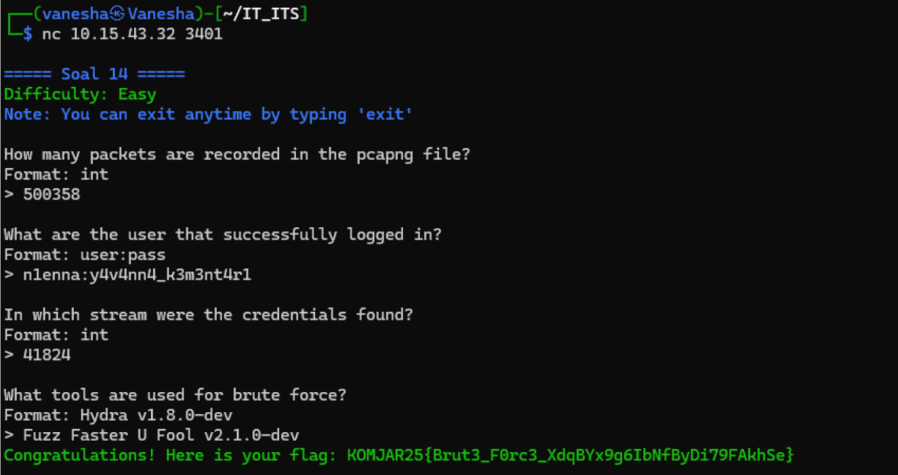


```c
Flag : KOMJAR25{Brut3_F0rc3_XdqBYx9g6IbNfByDi79FAkhSe}
```

### Soal 15

Melkor menyusup ke ruang server dan memasang keyboard USB berbahaya pada node Manwe. Buka file capture dan identifikasi pesan atau ketikan (keystrokes) yang berhasil 

nc 10.15.43.32 3402

#### Penjelasan

A) Disini kita bisa lihat melalui string deskriptor untuk mengetahui nya dimana disini bertuliskan Keyboard

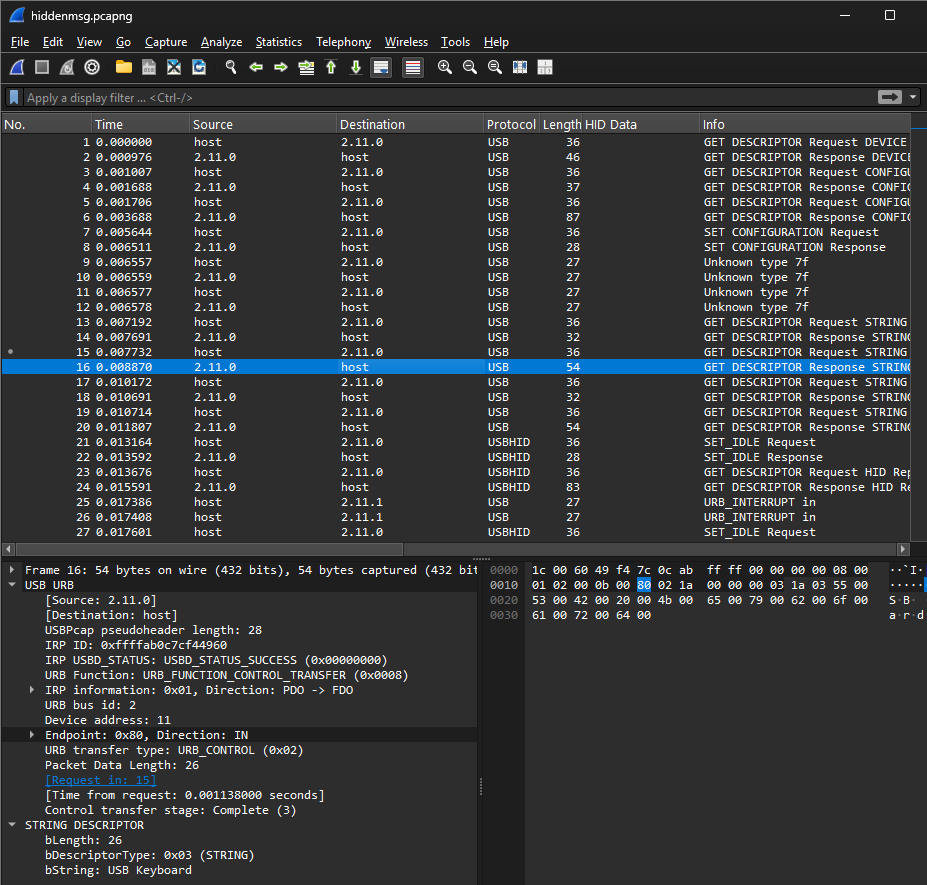


B) Pada soal ini kita filter menggunakan frame.len == 35

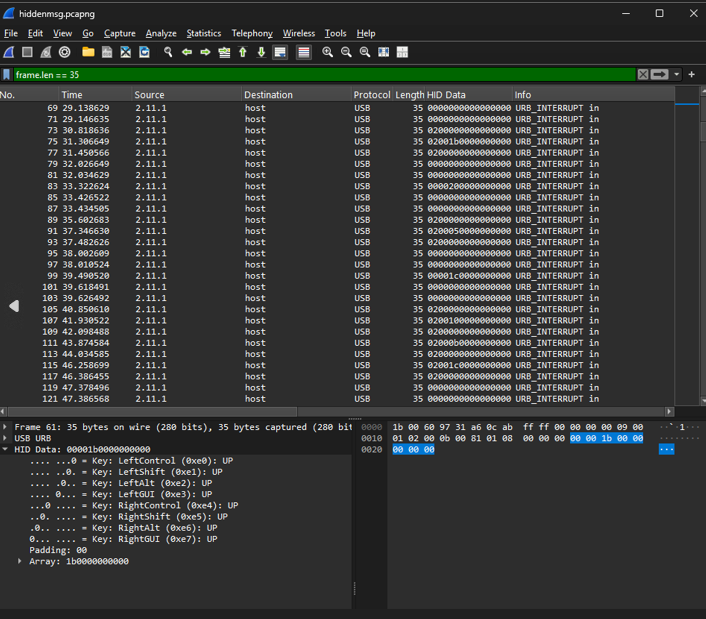

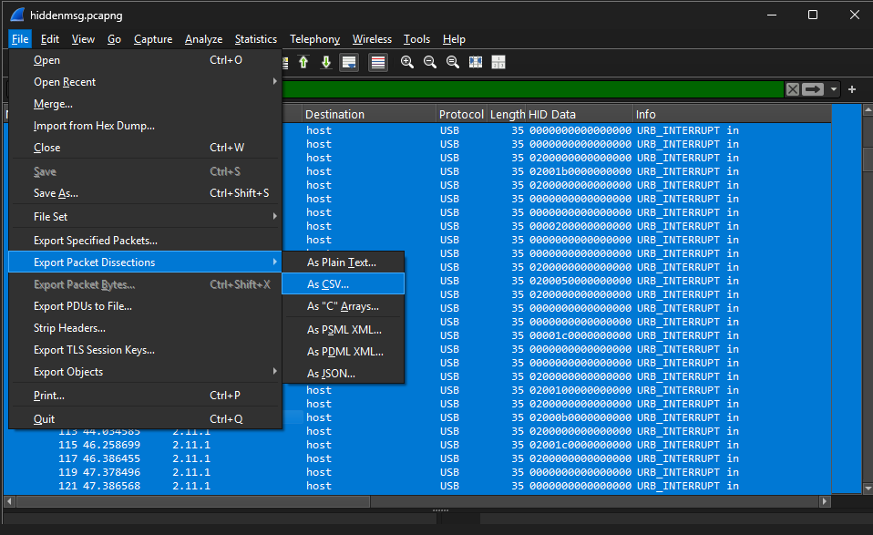

Setelah di download file csv nya buat decode menggunakan script.py

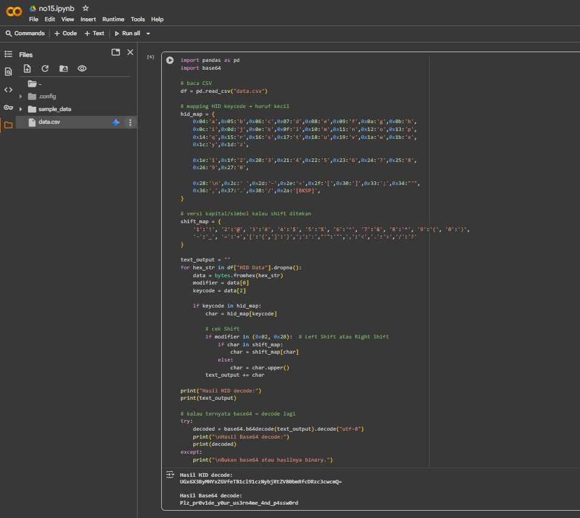


C) Lalu melakukan decode menggunakan base64


Final Result

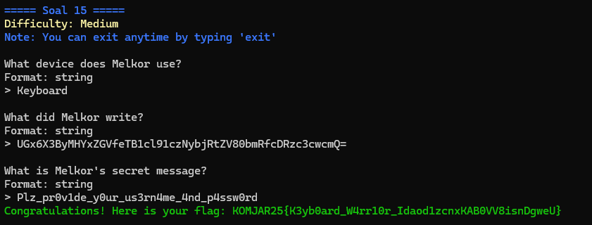


```c
Flag: KOMJAR25{K3yb0ard_W4rr10r_Idaod1zcnxKAB0VV8isnDgweU}
```

### Soal 16

#### Penjelasan

Melkor semakin murka ia meletakkan file berbahaya di server milik Manwe. Dari file capture yang ada, identifikasi file apa yang diletakkan oleh Melkor.

nc 10.15.43.32 3403

A) Credential account didapatkan ftp lalu melakukan follow > tcp stream

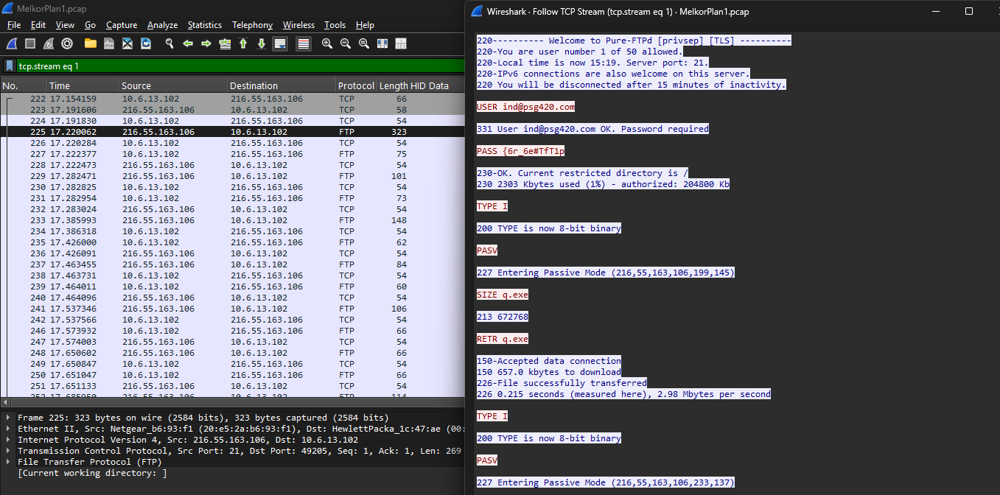

B) Tipe file malware biasanya diakhiri dengan .exe sehingga didapatkan 5 (e.exe, t.exe, q.exe, w.exe, r.exe)

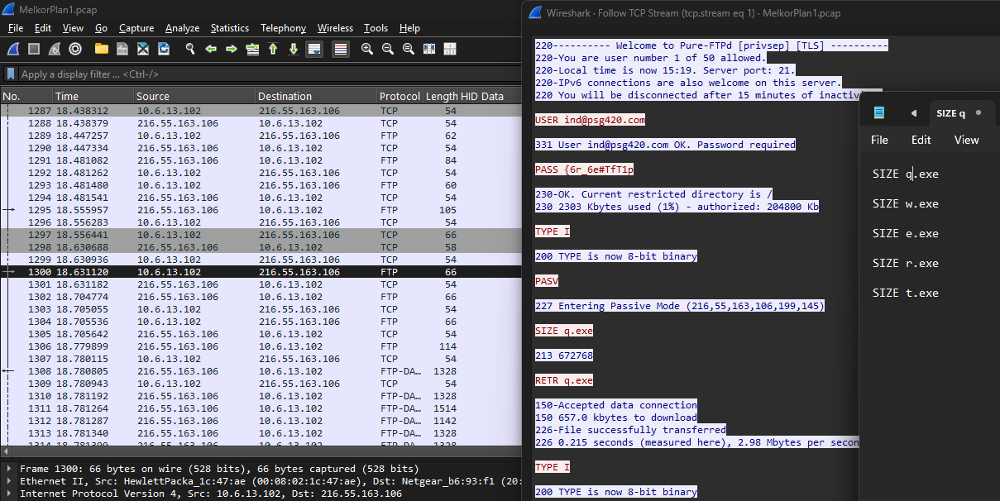


C) Mencari pada tipe tcp-data dan menyesuaikan nama file yang diminta lalu dilakukan follow > tcp stream lalu disave dalam bentuk raw dan mengeceknya dengan bash : sha256sum

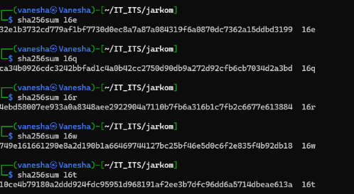


Final Result

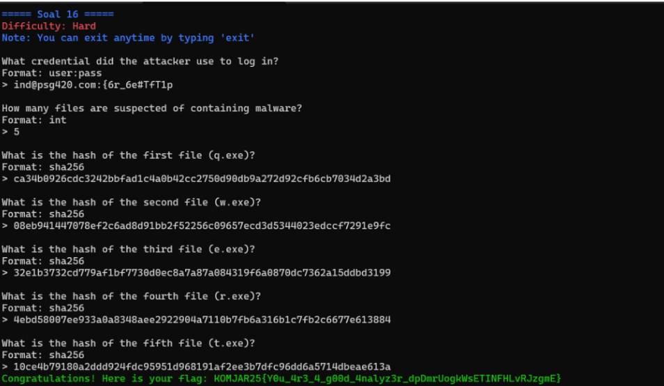


```c
Flag: KOMJAR25{Y0u_4r3_4_g00d_4nalyz3r_dpDmrUogkWsETINFHLvRJzgmE}
```

### Soal 17

#### Penjelasan

Manwe membuat halaman web di node-nya yang menampilkan gambar cincin agung. Melkor yang melihat web tersebut merasa iri sehingga ia meletakkan file berbahaya agar web tersebut dapat dianggap menyebarkan malware oleh Eru. Analisis file capture untuk menggagalkan rencana Melkor dan menyelamatkan web Manwe.

nc 10.15.43.32 3404

A) Mencari suspicius file pertama dengan cara ke file > Export Object > HTTP 

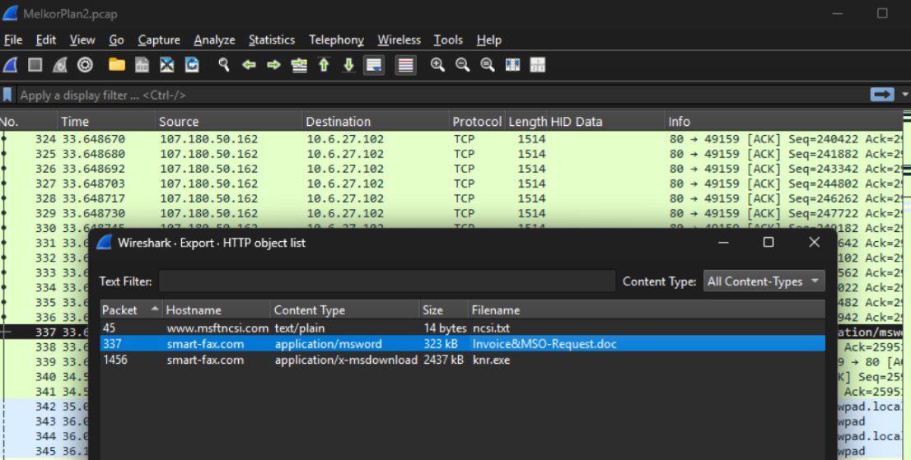


B) Mencari suspicius file kedua dengan cara ke file > Export Object > HTTP 

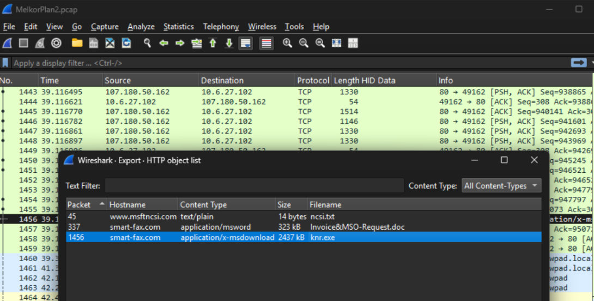


C) File disave dalam bentuk raw dan mengeceknya dengan bash : sha256sum

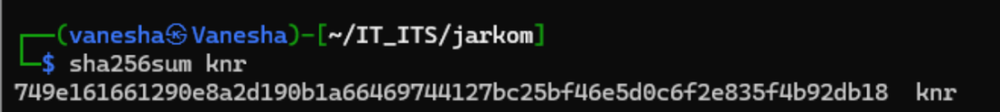


Final Result

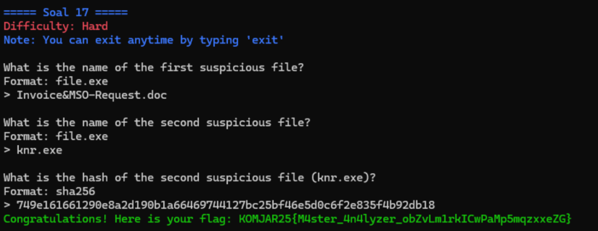


```c
Flag: KOMJAR25{M4ster_4n4lyzer_obZvLm1rkICwPaMp5mqzxxeZG}
```

### Soal 18

#### Penjelasan

Karena rencana Melkor yang terus gagal, ia akhirnya berhenti sejenak untuk berpikir. Pada saat berpikir ia akhirnya memutuskan untuk membuat rencana jahat lainnya dengan meletakkan file berbahaya lagi tetapi dengan metode yang berbeda. Gagalkan lagi rencana Melkor dengan mengidentifikasi file capture yang disediakan agar dunia tetap aman.

nc 10.15.43.32 3405

A) Sama seperti nomor sebelumnya, malware dapat di cek di file -> Export Object -> SMB, ciri file malware biasanya ada .exe disini terdapat 2 file yang berakhiran .exe

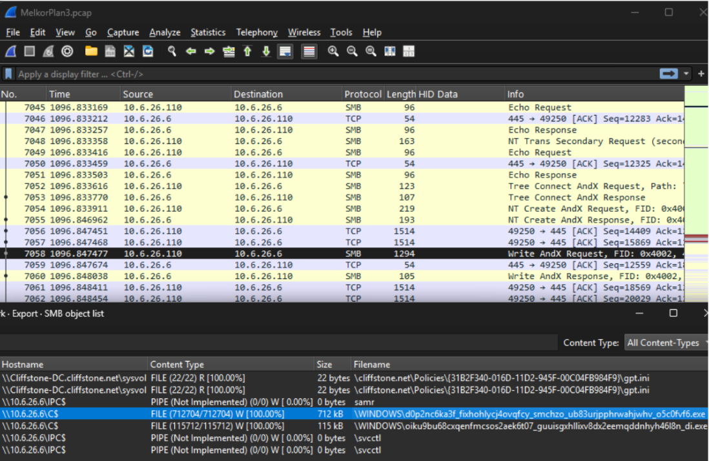


B) Begitu juga untuk file kedua 

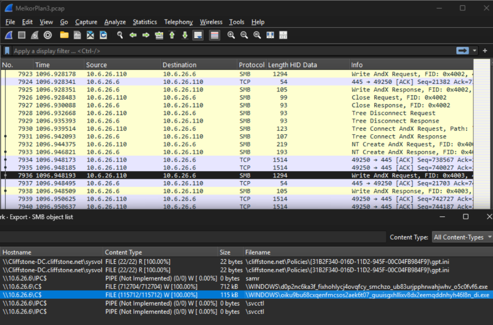


C) File disave dalam bentuk raw dan mengeceknya dengan bash : sha256sum

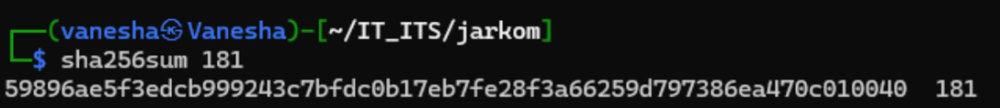


D) File disave dalam bentuk raw dan mengeceknya dengan bash : sha256sum

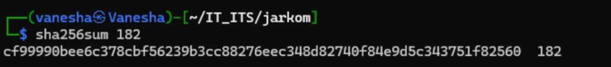


Final Result

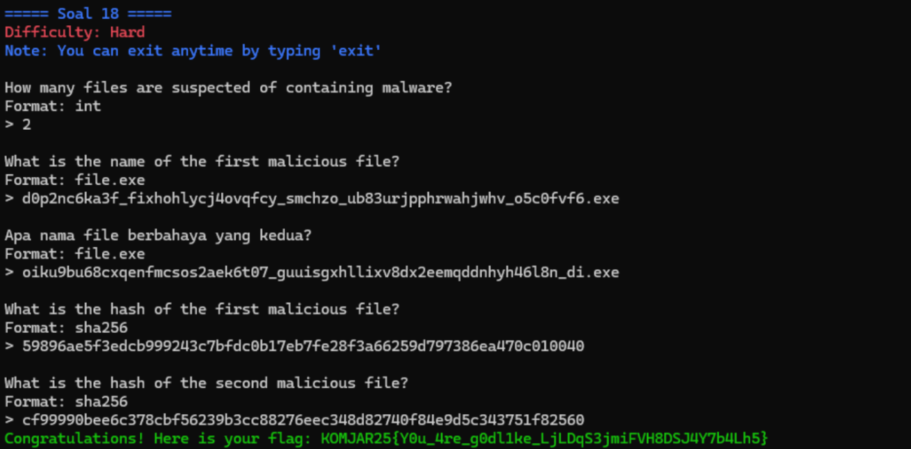


```c
Flag: KOMJAR25{Y0u_4re_g0dl1ke_LjLDqS3jmiFVH8DSJ4Y7b4Lh5}
```

### Soal 19

#### Penjelasan

Manwe mengirimkan email berisi surat cinta kepada Varda melalui koneksi yang tidak terenkripsi. Melihat hal itu Melkor sipaling jahat langsung melancarkan aksinya yaitu meneror Varda dengan email yang disamarkan. Analisis file capture jaringan dan gagalkan lagi rencana busuk Melkor.

nc 10.15.43.32 3406

A) Pertama lakukan filter menggunakan tcp.ack lalu cari file yang memiliki RST file

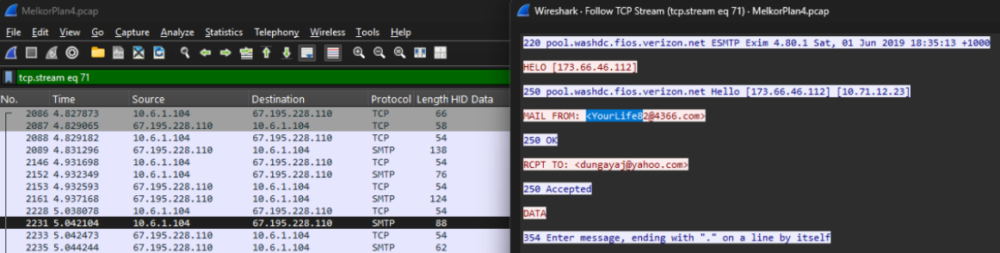


B) Pada 1 file yang sama didapatkan juga

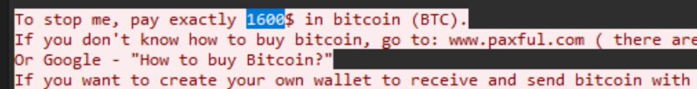

C) Pada 1 file yang sama juga didapatkan juga

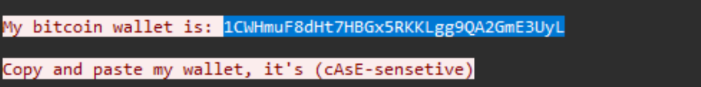


Final Result 

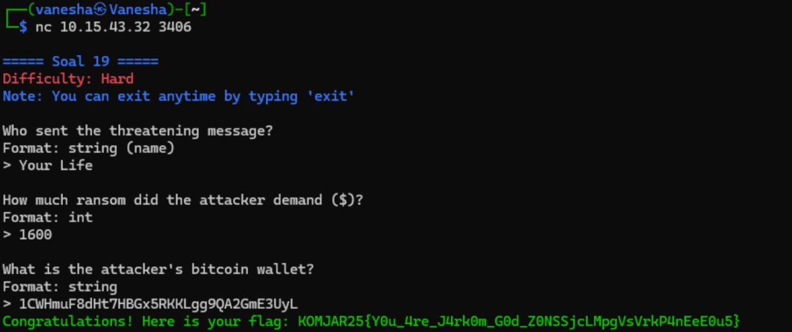


```c
Flag : KOMJAR25{Y0u_4re_J4rk0m_G0d_Z0NSSjcLMpgVsVrkP4nEeE0u5}
```

### Soal 20

#### Penjelasan

Untuk yang terakhir kalinya, rencana besar Melkor yaitu menanamkan sebuah file berbahaya kemudian menyembunyikannya agar tidak terlihat oleh Eru. Tetapi Manwë yang sudah merasakan adanya niat jahat dari Melkor, ia menyisipkan bantuan untuk mengungkapkan rencana Melkor. Analisis file capture dan identifikasi kegunaan bantuan yang diberikan oleh Manwe untuk menggagalkan rencana jahat Melkor selamanya.

nc 10.15.43.32 3407

A) TLSv1.2. Adalah protoko; TLS yang berfungsi untuk berkomunikasi, namun data tidak terkirim dalam bentuk plain text. Jadi, encryption methode yang digunakan untuk capture ini adalah TLS

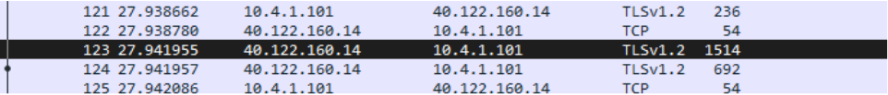


B) Lalu memasukkan file yang ada di drive (keyslogfile.txt) ke Edit  > Preferences > Protocol -> TLS > Masukkan keyslogfile.txt > Apply Lalu sama seperti step pada soal sebelumnya File > Export Objects > HTTP

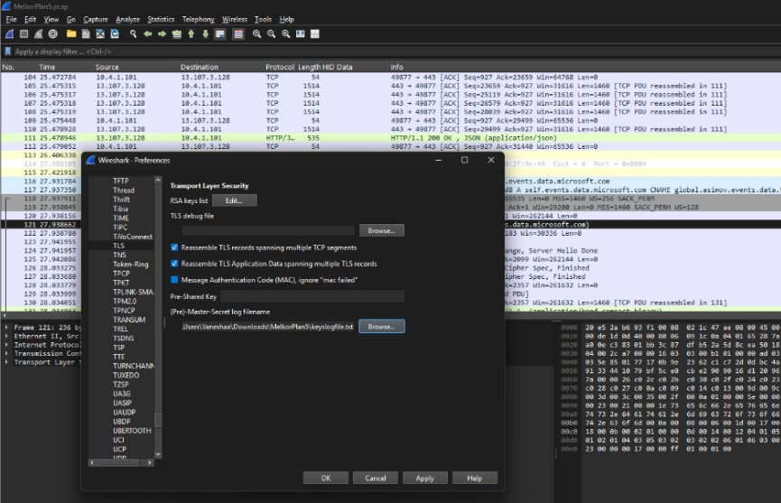

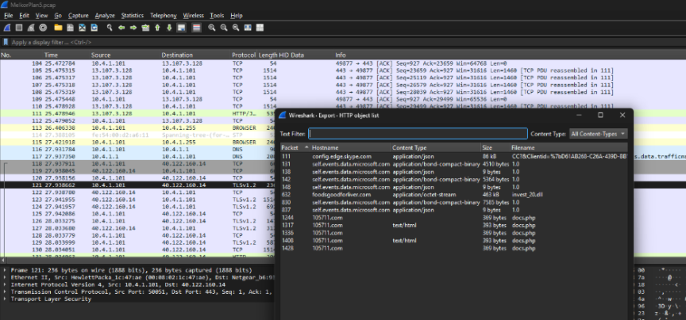

C) File disave dalam bentuk raw dan mengeceknya dengan bash : sha256sum

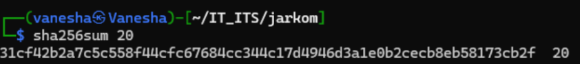


Final Result

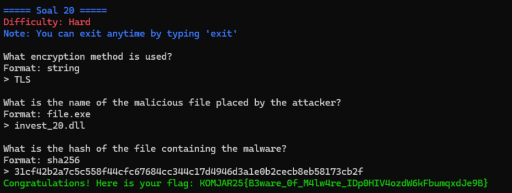


```c
Flag: KOMJAR25{B3ware_0f_M4lw4re_IDp0HIV4ozdW6kFbumqxdJe9B}
```